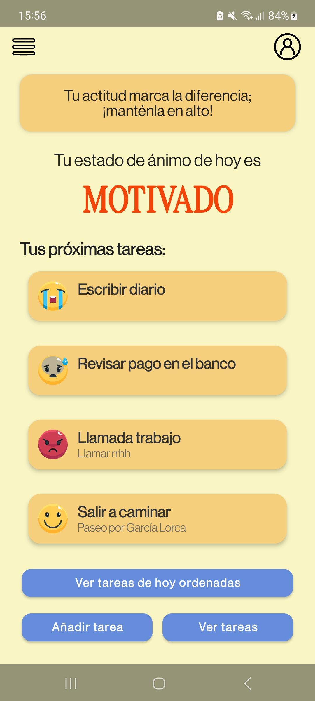
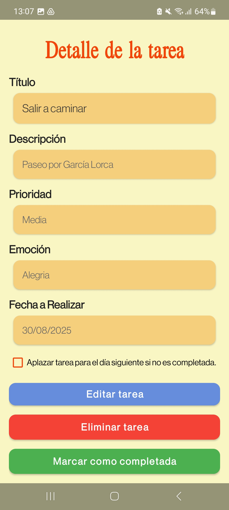
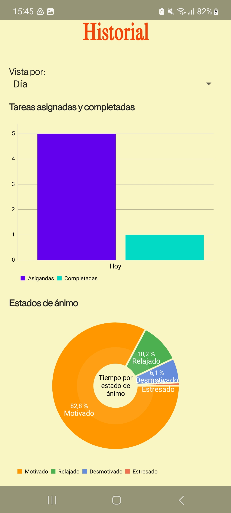

  

# Organizador Emocional 📱🧠

Aplicación Android desarrollada en **Kotlin** como parte del **Trabajo de Fin de Grado (Universidad de Granada)**.  
El objetivo es ayudar al usuario a **gestionar sus tareas diarias teniendo en cuenta su estado emocional**, combinando productividad con bienestar personal.  

Incluye registro de estado de ánimo, orden adaptativo de tareas por **costo emocional**, **notificaciones motivacionales**, estadísticas y **sincronización con Google Calendar**.  

---

## 📲 Descargar

👉 **https://github.com/ceciliacarpe/OrganizadorEmocional/releases/latest/download/Organizador.Emocional.apk**  

---

## ✨ Funcionalidades

- Registro diario de estado de ánimo 
- Creación, edición y eliminación de tareas con **prioridad y emoción asociada**  
- Algoritmo de ordenación por **costo emocional** adaptado al estado de ánimo del día  
- **Notificaciones motivacionales**, aviso de tareas de alta prioridad y resumen de tareas pendientes 
- Visualización estadística con gráficos de **estados emocionales** y **tareas pendientes vs tareas completadas**  
- **Sincronización unidireccional con Google Calendar**  
- Interfaz clara y adaptativa con soporte para diferentes tamaños de pantalla  

---

## 🖼️ Capturas

  
  
  

---

## ⚙️ Tecnologías utilizadas

- **Lenguaje:** Kotlin  
- **Arquitectura:**  Model–View–ViewModel, LiveData  
- **Base de datos:** Firebase Firestore  
- **Sincronización:** Google Calendar API  
- **Background tasks:** WorkManager   
- **Visualización:** MPAndroidChart, Lottie  

---

## 📄 Licencia

Este proyecto está bajo la licencia **Apache 2.0**.  
Consulta el archivo [LICENSE](LICENSE) para más información.  

---

## 👩‍🎓 Información académica

**Trabajo de Fin de Grado (TFG)** en Ingeniería Informática  
**Universidad de Granada (UGR)** – Curso 2024/2025  

**Autor:** Cecilia Caraballo Pérez
